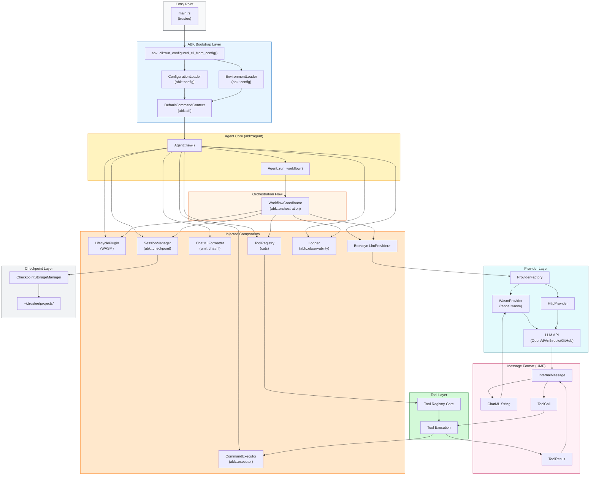

# Current Data Flow

**Document Purpose:** This document describes the current data flow in the Trustee ecosystem as-is, without proposing changes.

**Analysis Date:** November 29, 2025  
**Branch:** coupled  
**Scope:** Runtime data flow through ABK, CATS, UMF, Lifecycle, and Provider components

---

## High-Level Data Flow Diagram



---

## Data Flow Stages

### Stage 1: Entry and Bootstrap

**Entry Point:** `src/main.rs`
```rust
#[tokio::main]
async fn main() -> Result<(), Box<dyn std::error::Error>> {
    abk::cli::run_configured_cli_from_config("config/trustee.toml").await
}
```

**Data Flow:**
1. Tokio async runtime starts
2. Calls ABK CLI runner with config path
3. `ConfigurationLoader` reads `config/trustee.toml`
4. `EnvironmentLoader` loads environment variables (`.env` file + shell env)
5. `DefaultCommandContext` constructed with merged configuration
6. CLI arguments parsed
7. Command dispatched to appropriate handler

**Data Objects:**
- `Configuration` struct (execution, llm, logging, checkpointing, templates)
- Environment variables map
- CLI arguments

---

### Stage 2: Agent Construction

**Construction Sequence:**
```
DefaultCommandContext::create_agent()
  → Agent::new(config, env)
    → Load LifecyclePlugin (WASM)
    → Create Provider (via ProviderFactory)
    → Create ChatMLFormatter (UMF)
    → Create ToolRegistry (CATS)
    → Create CommandExecutor
    → Create Logger
    → Create SessionManager (if checkpointing enabled)
```

**Data Dependencies:**

| Component | Created From | Data Required |
|-----------|--------------|---------------|
| LifecyclePlugin | `~/.trustee/lifecycles/lifecycle.wasm` | WASM binary |
| Provider | ProviderFactory | Env vars (API keys, endpoints) |
| ChatMLFormatter | `umf::chatml::ChatMLFormatter::new()` | None |
| ToolRegistry | `cats::create_tool_registry_with_open_window_size()` | Window size config |
| CommandExecutor | `CommandExecutor::new()` | Timeout duration |
| Logger | `Logger::new()` | Log path, log level |
| SessionManager | `SessionManager::new()` | Project path, config |

---

### Stage 3: Orchestration Loop

**Workflow Coordination Flow:**

```
Agent::run_workflow(task)
  → classify_task(task) via LifecyclePlugin
  → load_system_template(task_type) via LifecyclePlugin
  → render_task_template(task, task_type) via LifecyclePlugin
  → add initial messages to conversation
  
  → FOR iteration in 1..max_iterations:
      → checkpoint_session() (every N iterations)
      → call_provider() → LLM response
      
      → IF response is text:
          → add assistant message
          → check completion markers
          
      → IF response has tool_calls:
          → add assistant message with tool calls
          → FOR each tool_call:
              → execute_tool(tool_call)
              → add tool result message
          
      → check iteration/token limits
```

**Data Objects in Loop:**

| Stage | Input Data | Output Data |
|-------|------------|-------------|
| Classification | task string | task_type string |
| Template Loading | task_type | template string |
| Template Rendering | template + JSON data | rendered InternalMessage |
| Provider Call | Vec<InternalMessage> + config | GenerateResponse |
| Tool Execution | ToolCall (name, args) | ToolResult (content, is_error) |
| Checkpointing | current state | JSON checkpoint file |

---

### Stage 4: Provider Interaction

**Provider Request Flow:**

```
Agent
  → Provider.generate(messages, config)
    → ChatMLFormatter.format(messages)
      → Vec<InternalMessage> → Vec<ChatMLMessage>
    → WasmProvider.format_request(chatml_messages, config, tools)
      → Tanbal WASM: format-request(messages_json, config_json)
      → Returns provider-specific request JSON
    → Host HTTP executor sends request to LLM API
    → Receives response body
    → WasmProvider.parse_response(body)
      → Tanbal WASM: parse-response(body_json)
      → Returns GenerateResponse
    → Convert to InternalMessage
```

**Message Transformation Chain:**

```
InternalMessage (UMF)
  ↓ ChatMLFormatter.format()
ChatMLMessage (UMF)
  ↓ JSON serialization
JSON String
  ↓ Tanbal WASM: format-request()
Provider-specific JSON (OpenAI/Anthropic format)
  ↓ HTTP POST
LLM API
  ↓ HTTP Response
Response JSON
  ↓ Tanbal WASM: parse-response()
GenerateResponse
  ↓ Conversion
InternalMessage (UMF)
```

**Streaming Flow (when enabled):**

```
Agent
  → Provider.generate_streaming(messages, config)
    → Same format process
    → Host HTTP establishes SSE stream
    → FOR each SSE event:
        → WasmProvider.parse_stream_event(event)
          → Tanbal WASM: parse-stream-event(event_json)
          → Returns ContentDelta
        → StreamingAccumulator.add_chunk(delta)
    → StreamingAccumulator.finalize()
    → Returns complete InternalMessage
```

---

### Stage 5: Tool Execution

**Tool Execution Flow:**

```
LLM Response with tool_calls
  → Agent.handle_tool_calls(tool_calls)
    → FOR each tool_call:
        → Extract tool name and arguments (JSON)
        → ToolRegistry.execute_tool(name, args_json)
          → Lookup tool by name
          → Deserialize args to ToolArgs
          → Tool.execute(args, state)
            → IF run_command:
                → CommandExecutor.execute(command, args)
                → Returns ExecutionResult
            → ELSE (file ops, search, etc):
                → Direct filesystem/regex operations
          → Returns ToolResult { success, message, stdout, stderr }
        → Convert to ContentBlock::ToolResult
        → Wrap in InternalMessage with tool_call_id
    → All results added to conversation
```

**Tool Categories and Data Flow:**

| Category | Tools | Data In | Data Out |
|----------|-------|---------|----------|
| File Navigation | open, goto, scroll_* | file path, line number | file content window |
| Search | find_file, search_file, search_dir | pattern, path | matches list |
| Editing | create_file, replace_text, insert_text, delete_* | path, content/pattern | success message |
| Execution | run_command | command, args | stdout, stderr, exit code |
| Utilities | _state, filemap, submit | varies | state dump, tree, completion |

---

### Stage 6: Checkpoint Flow

**Checkpoint Save Flow:**

```
Orchestration (every N iterations)
  → SessionManager.checkpoint()
    → Create Checkpoint struct:
        - session_id
        - timestamp
        - iteration
        - conversation: Vec<InternalMessage>
        - state: CheckpointState
        - metadata
    → Serialize to JSON
    → Compress with gzip
    → Write to ~/.trustee/projects/<hash>/sessions/<id>_<seq>.json.gz
    → Update session metadata file
```

**Checkpoint Resume Flow:**

```
CLI: trustee resume
  → CheckpointStorageManager.list_sessions(project_path)
  → User selects session
  → SessionStorage.load_checkpoint(session_id, sequence)
    → Read ~/.trustee/projects/<hash>/sessions/<id>_<seq>.json.gz
    → Decompress
    → Deserialize JSON → Checkpoint
  → Agent::from_checkpoint(checkpoint)
    → Restore conversation history
    → Restore tool state
    → Restore iteration counter
    → Restore task description
  → Continue orchestration from saved state
```

**Checkpoint Data Structure:**

```json
{
  "session_id": "01H8XXXXX",
  "timestamp": "2025-11-29T10:30:45Z",
  "iteration": 15,
  "conversation": [
    { "role": "system", "content": "..." },
    { "role": "user", "content": "..." },
    { "role": "assistant", "content": "...", "tool_calls": [...] },
    { "role": "tool", "tool_call_id": "call_123", "content": "..." }
  ],
  "state": {
    "task_description": "...",
    "current_mode": "auto",
    "current_step": "PlanningLoop",
    "tool_state": { "open_file": "src/main.rs", "window_start": 1 },
    "api_call_count": 12
  },
  "metadata": {
    "agent_version": "0.1.0",
    "abk_version": "0.1.30"
  }
}
```

---

### Stage 7: Lifecycle Plugin Interaction

**Lifecycle WASM Interface:**

```
WIT Interface:
  load-template(name: string) → result<string, string>
  render-template(template: string, data: string) → result<string, string>
  classify-task(description: string) → result<string, string>
  get-system-info() → string
```

**Template Names Used:**

| Template | Purpose | Data Passed |
|----------|---------|-------------|
| `system_prompt` | Initial system message | agent config |
| `task_start` | Task introduction | task description, task_type |
| `action_observation` | Tool result summary | tool name, result |
| `completion` | Task completion | summary |

**Data Flow:**

```
Agent
  → LifecyclePlugin.load_template("system_prompt")
    → WASM instance.call("load-template", "system_prompt")
    → Returns template string (with placeholders)
  → LifecyclePlugin.render_template(template, json_data)
    → WASM instance.call("render-template", template, data_json)
    → Returns rendered string
  → Convert to InternalMessage
```

---

## Message Type Definitions (UMF)

### Core Types

**InternalMessage:**
```rust
pub struct InternalMessage {
    pub role: MessageRole,        // system, user, assistant, tool
    pub content: MessageContent,  // Text(String) or Blocks(Vec<ContentBlock>)
    pub name: Option<String>,
    pub tool_call_id: Option<String>,
    pub metadata: Option<HashMap<String, Value>>,
}
```

**ContentBlock Variants:**
```rust
pub enum ContentBlock {
    Text { text: String },
    ToolUse { id: String, name: String, input: Value },
    ToolResult { tool_call_id: String, content: String, is_error: bool },
}
```

**ToolCall:**
```rust
pub struct ToolCall {
    pub id: String,
    pub name: String,
    pub input: Value,  // JSON arguments
}
```

**GenerateResponse:**
```rust
pub enum GenerateResponse {
    Content(String),
    ToolCalls(Vec<ToolCall>),
}
```

---

## Component Dependencies Summary

```
┌─────────────────────────────────────────────────────────────────┐
│                         TRUSTEE                                  │
│                      (orchestrator)                              │
└─────────────────────────┬───────────────────────────────────────┘
                          │
                          ▼
┌─────────────────────────────────────────────────────────────────┐
│                          ABK                                     │
│   ┌─────────────────────────────────────────────────────────┐   │
│   │ agent (depends on all below)                             │   │
│   └─────────────────────────────────────────────────────────┘   │
│         │          │          │          │          │           │
│         ▼          ▼          ▼          ▼          ▼           │
│   ┌─────────┐ ┌─────────┐ ┌─────────┐ ┌─────────┐ ┌─────────┐  │
│   │ config  │ │checkpoint│ │provider │ │orchestr.│ │executor │  │
│   └─────────┘ └─────────┘ └─────────┘ └─────────┘ └─────────┘  │
│         │          │          │          │                      │
│         └──────────┴──────────┴──────────┘                      │
│                          │                                       │
└──────────────────────────┼───────────────────────────────────────┘
                           │
         ┌─────────────────┼─────────────────┐
         │                 │                 │
         ▼                 ▼                 ▼
   ┌───────────┐    ┌───────────┐    ┌─────────────────┐
   │    UMF    │    │   CATS    │    │ WASM Plugins    │
   │ (messages)│    │  (tools)  │    │                 │
   └───────────┘    └───────────┘    │ ┌─────────────┐ │
                                     │ │  lifecycle  │ │
                                     │ │  (coder)    │ │
                                     │ └─────────────┘ │
                                     │ ┌─────────────┐ │
                                     │ │  provider   │ │
                                     │ │  (tanbal)   │ │
                                     │ └─────────────┘ │
                                     └─────────────────┘
```

---

## Data Flow Summary Table

| Stage | From | To | Data Type | Transport |
|-------|------|----|-----------|-----------|
| Bootstrap | TOML file | ConfigurationLoader | Configuration | File read |
| Bootstrap | .env/shell | EnvironmentLoader | HashMap | Env vars |
| Agent Init | Config | Agent | Various components | Constructor |
| Classify | Agent | LifecyclePlugin | task string | WASM call |
| Template | LifecyclePlugin | Agent | template string | WASM call |
| LLM Call | Agent | Provider | Vec<InternalMessage> | Function call |
| Format | InternalMessage | ChatML | ChatMLMessage | Formatter |
| WASM Format | ChatML | JSON | Provider JSON | WASM call |
| HTTP | JSON | LLM API | HTTP request | reqwest |
| Parse | Response JSON | InternalMessage | GenerateResponse | WASM call |
| Tool Exec | ToolCall | ToolRegistry | ToolArgs | JSON deserialization |
| Command | Tool | Executor | command + args | Process spawn |
| Result | Executor | Tool | ExecutionResult | Return |
| Checkpoint | Agent state | Storage | Checkpoint JSON | gzip + file write |

---

**Document Status:** Current state documentation only  
**Related Document:** Hypothesis and Current Situation (separate file)
