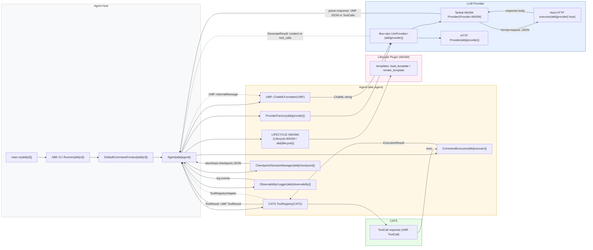

# Data Flow Diagram — Trustee (Simpaticoder)

This file documents my understanding of the current, tightly-coupled runtime wiring and the recommended decoupling boundaries. It contains a Mermaid diagram you can render in VS Code (Mermaid preview) and an explanation of message shapes, interfaces, and practical next steps.

## Mermaid diagram (render with a Mermaid preview)

## Executive summary of understanding

- Entry point: `src/main.rs` calls `abk::cli::run_configured_cli_from_config("config/trustee.toml")` which constructs a `DefaultCommandContext` and runs the CLI runner.
- CLI -> Agent: `DefaultCommandContext::create_agent()` calls `crate::agent::Agent::new(...)`.
- Agent construction wires together these major components:
  - Lifecycle plugin (WASM) — templates, classification, render functions (e.g., `load_template`, `render_template`).
  - ProviderFactory creates a `Box<dyn LlmProvider>` (provider trait) — can be a WASM provider (`tanbal`) or an HTTP-backed provider.
  - UMF (Universal Message Format) chatml formatter — converts `umf::InternalMessage` into ChatML strings for the provider.
  - CATS ToolRegistry — a registry of tools (file ops, edit, run_command) and tool execution logic.
  - CommandExecutor — executes system commands and produces `ExecutionResult`.
  - Checkpoint/SessionManager and Observability (logging/metrics).

## Key message shapes and interfaces

- UMF::InternalMessage
  - role: system|user|assistant|tool
  - content: Text or Blocks (ContentBlock)
  - metadata, tool_call_id, name

- ContentBlock::ToolUse
  - { id, name, input } — used when assistant issues a tool call

- Provider WASM interface (Tanbal - from AGENTS.md)
  - format-request(config_json, messages_json) -> Result<String, String>
  - parse-response(response_body) -> Result<String, String>
  - parse-stream-event(event) -> Result<String, String>

- Tool execution
  - Agent translates provider tool calls (UMF ToolCall/ContentBlock::ToolUse) into CATS tool invocations
  - CATS tools return ExecutionResult (stdout, stderr, return_code, success)
  - Agent converts ExecutionResult -> UMF ToolResult blocks or uses lifecycle `action_observation` templates to summarize

## Where coupling is strongest (and why)

- ABK builds concrete CATS registry in `Agent::new` (`create_tool_registry_with_open_window_size`) — direct static dependency on `cats`.
- ABK requests a provider via `ProviderFactory::create(&env)`; the concrete provider may be implemented as a feature or local crate (tanbal WASM). ABK ties together features instead of using a strict trait/adapter boundary at runtime.
- UMF types are used across agent, provider, and tools; this is appropriate but must be an explicit dependency (UMF already exists as a crate in `tmp/umf`).
- Lifecycle is correctly separated (WASM plugin) but ABI expectations (template names and JSON shapes) must be treated as a stable interface.

## Components (one-line job descriptions)

`abk[checkpoint]` — Manage session checkpoints: store, list, restore, and resume agent sessions.

`abk[config]` — Load configuration from TOML and environment variables and expose runtime settings.

`abk[executor]` — Execute shell commands safely with timeouts, capture output, and validate dangerous commands.

`abk[lifecycle]` — Load and call lifecycle WASM plugins for templates, task classification, and rendering.

`abk[provider]` — Provide a small LLM provider abstraction and factory to create concrete providers.

`abk[cli]` — Bootstrap and run the CLI, wiring adapter traits to the host environment.

`abk[orchestration]` — Coordinate multi-step workflows, tool invocation ordering, and runtime orchestration.

`abk[agent]` — Core agent runtime: wire components together, handle messages, tool-calls and sessions.

`abk[observability]` — Structured logging and telemetry for sessions, LLM interactions, and errors.

`CATS` — Provide a registry of tools (file ops, editing, search, run_command) and execute tool calls.

`UMF` — Canonical internal message format (InternalMessage, ContentBlock, ToolCall/ToolResult) and ChatML helpers.

`Lifecycle-WASM` — WASM lifecycle plugin that supplies templates, classification and rendering (isolated template logic).

`Provider-WASM` — WASM provider implementation that formats requests and parses responses (handles backend differences and streaming inside WASM).

