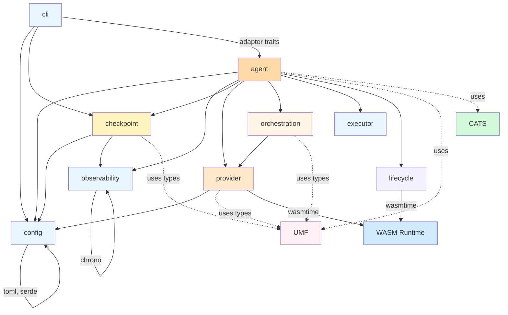

# Data Flow Diagram — Trustee Architecture Analysis (Claude 4.5)

This document provides a comprehensive understanding of Trustee's architecture based on analyzing the actual source code in `tmp/` directories. It reveals the true coupling relationships, data flows, and architectural decisions.

## Executive Summary

Trustee is designed as a **thin orchestration layer** that composes functionality from three main external crates:
- **ABK** (Agent Builder Kit) - Feature-gated modular framework providing all agent building blocks
- **CATS** (Code Agent Tool System) - LLM-facing tools and execution logic
- **UMF** (Universal Message Format) - Message formatting and streaming support

The architecture reveals **feature-based coupling** where ABK acts as a monolithic crate with optional features rather than truly independent modules. This creates a hybrid between modularity and tight integration.

## Complete Data Flow Diagram

```mermaid
flowchart TB
    subgraph Entry["Entry Point"]
        MAIN["main.rs<br/>tokio::main"]
    end

    subgraph ABKCLIBoot["ABK CLI Bootstrap Layer"]
        RUNCLI["abk::cli::run_configured_cli_from_config()"]
        CFGLOADER["ConfigurationLoader<br/>(abk[config])"]
        ENVLOADER["EnvironmentLoader<br/>(abk[config])"]
        CONTEXT["DefaultCommandContext<br/>(abk[cli])"]
    end

    subgraph AgentCore["Agent Core (abk[agent])"]
        AGENTINIT["Agent::new()"]
        AGENTSTATE["Agent State:<br/>- mode<br/>- iteration<br/>- api_call_count<br/>- task_description<br/>- session_manager"]
        AGENTRUN["Agent::run_workflow()"]
    end

    subgraph Dependencies["Agent Dependencies (Injected at Construction)"]
        LIFECYCLE["LifecyclePlugin<br/>(abk[lifecycle])"]
        PROVIDER["Box&lt;dyn LlmProvider&gt;<br/>(abk[provider])"]
        FORMATTER["ChatMLFormatter<br/>(UMF::chatml)"]
        TOOLREG["ToolRegistry<br/>(CATS)"]
        EXECUTOR["CommandExecutor<br/>(abk[executor])"]
        LOGGER["Logger<br/>(abk[observability])"]
        SESSION["SessionManager<br/>(abk[checkpoint])"]
    end

    subgraph ProviderLayer["LLM Provider Layer"]
        PROVFACTORY["ProviderFactory::create()<br/>(abk[provider])"]
        WASMPROVIDER["WasmProvider<br/>(tanbal.wasm)"]
        HTTPPROVIDER["HttpProvider<br/>(abk[provider])"]
        
        subgraph WasmRuntime["WASM Runtime (wasmtime)"]
            WENGINE["WASM Engine<br/>(wasmtime::Engine)"]
            WLINKER["WASI Linker<br/>(wasmtime_wasi)"]
            TANBAL["Tanbal Provider WASM<br/>(format/parse)"]
        end
    end

    subgraph LifecycleLayer["Lifecycle Plugin Layer"]
        LCWASM["lifecycle.wasm<br/>(coder-lifecycle)"]
        LCTEMPLATES["Templates:<br/>- system_prompt<br/>- task_start<br/>- action_observation<br/>- completion"]
        LCCLASS["Classification:<br/>- classify_task()<br/>- render_template()"]
    end

    subgraph ToolsLayer["CATS Tool System"]
        TOOLCORE["Tool Core:<br/>- Tool trait<br/>- ToolRegistry<br/>- ToolArgs"]
        
        subgraph ToolCategories["Tool Categories"]
            FILENAV["File Navigation:<br/>- open<br/>- goto<br/>- scroll_up/down"]
            SEARCH["Search:<br/>- find_file<br/>- search_file<br/>- search_dir"]
            EDIT["Editing:<br/>- create_file<br/>- replace_text<br/>- insert_text<br/>- delete_text<br/>- overwrite_file"]
            FILEMGMT["File Mgmt:<br/>- delete_path<br/>- move_path<br/>- copy_path<br/>- create_directory"]
            EXECUTE["Execution:<br/>- run_command"]
            UTIL["Utilities:<br/>- _state<br/>- filemap<br/>- submit<br/>- classify_task"]
        end
    end

    subgraph MessageFlow["Message Flow (UMF)"]
        INTMSG["InternalMessage<br/>(UMF)"]
        CHATML["ChatML String<br/>(formatted)"]
        CONTENTBLOCK["ContentBlock:<br/>- Text<br/>- ToolUse<br/>- ToolResult"]
        TOOLCALL["ToolCall:<br/>- id<br/>- name<br/>- input"]
        TOOLRESULT["ToolResult:<br/>- tool_call_id<br/>- content"]
    end

    subgraph OrchestrationFlow["Orchestration Flow (abk[orchestration])"]
        ORCH["WorkflowCoordinator"]
        ORCHINVOKE["invoke_provider()"]
        ORCHTOOLS["coordinate_tools()"]
        ORCHCHECK["checkpoint & resume"]
        ORCHTEMP["load/render templates"]
        ORCHOBS["observability / logs"]
    end

    subgraph ExecutionFlow["Execution Results"]
        EXECRESULT["ExecutionResult:<br/>- stdout<br/>- stderr<br/>- return_code<br/>- success"]
        GENRESPONSE["GenerateResponse:<br/>- content OR<br/>- tool_calls"]
        STREAM["StreamingResponse<br/>(umf[streaming])"]
    end

    subgraph CheckpointFlow["Session Management"]
        CHKMGR["CheckpointStorageManager"]
        PROJSTORE["ProjectStorage<br/>(~/.trustee/projects/)"]
        SESSSTORE["SessionStorage<br/>(sessions/*.json)"]
        CKPTDATA["Checkpoint Data:<br/>- conversation<br/>- state<br/>- metadata"]
    end

    %% Entry flow
    MAIN --> RUNCLI
    RUNCLI --> CFGLOADER
    RUNCLI --> ENVLOADER
    RUNCLI --> CONTEXT
    CONTEXT --> AGENTINIT

    %% Agent initialization
    AGENTINIT --> AGENTSTATE
    AGENTINIT -.->|"loads"| LIFECYCLE
    AGENTINIT -.->|"creates via factory"| PROVIDER
    AGENTINIT -.->|"initializes"| FORMATTER
    AGENTINIT -.->|"creates registry"| TOOLREG
    AGENTINIT -.->|"creates"| EXECUTOR
    AGENTINIT -.->|"initializes"| LOGGER
    AGENTINIT -.->|"creates"| SESSION

    %% Agent runtime
    AGENTSTATE --> AGENTRUN
    AGENTRUN --> ORCH

    %% Provider creation
    PROVFACTORY --> WASMPROVIDER
    PROVFACTORY --> HTTPPROVIDER
    WASMPROVIDER --> WENGINE
    WENGINE --> WLINKER
    WLINKER --> TANBAL

    %% Lifecycle
    LIFECYCLE --> LCWASM
    LCWASM --> LCTEMPLATES
    LCWASM --> LCCLASS

    %% Tools
    TOOLREG --> TOOLCORE
    TOOLCORE --> FILENAV
    TOOLCORE --> SEARCH
    TOOLCORE --> EDIT
    TOOLCORE --> FILEMGMT
    TOOLCORE --> EXECUTE
    TOOLCORE --> UTIL

    %% Message flow
    INTMSG --> CHATML
    INTMSG --> CONTENTBLOCK
    CONTENTBLOCK --> TOOLCALL
    CONTENTBLOCK --> TOOLRESULT

    %% Orchestration coordination
    ORCH --> ORCHINVOKE
    ORCH --> ORCHTOOLS
    ORCH --> ORCHCHECK
    ORCH --> ORCHTEMP
    ORCH --> ORCHOBS

    %% Execution connections
    ORCHINVOKE --> PROVIDER
    PROVIDER --> FORMATTER
    FORMATTER --> CHATML
    CHATML --> TANBAL
    TANBAL -.->|"format-request"| GENRESPONSE
    TANBAL -.->|"parse-response"| INTMSG
    TANBAL -.->|"streaming"| STREAM

    %% Tool execution
    ORCHTOOLS --> TOOLREG
    TOOLREG --> EXECUTE
    EXECUTE --> EXECUTOR
    EXECUTOR --> EXECRESULT
    EXECRESULT --> TOOLRESULT

    %% Checkpoint flow
    ORCHCHECK --> SESSION
    SESSION --> CHKMGR
    CHKMGR --> PROJSTORE
    PROJSTORE --> SESSSTORE
    SESSSTORE --> CKPTDATA

    %% Template rendering
    ORCHTEMP --> LIFECYCLE
    LIFECYCLE -.->|"load_template"| INTMSG
    LIFECYCLE -.->|"render_template"| INTMSG

    %% Logging
    ORCHOBS --> LOGGER

    style Entry fill:#f8f9fa,stroke:#495057
    style ABKCLIBoot fill:#e7f5ff,stroke:#1971c2
    style AgentCore fill:#fff3bf,stroke:#f59f00
    style Dependencies fill:#ffe8cc,stroke:#fd7e14
    style ProviderLayer fill:#e3fafc,stroke:#0b7285
    style WasmRuntime fill:#d0ebff,stroke:#1864ab
    style LifecycleLayer fill:#f3f0ff,stroke:#6741d9
    style ToolsLayer fill:#d3f9d8,stroke:#2b8a3e
    style ToolCategories fill:#ebfbee,stroke:#37b24d
    style MessageFlow fill:#fff0f6,stroke:#c2255c
    style OrchestrationFlow fill:#fff4e6,stroke:#e8590c
    style ExecutionFlow fill:#ffe8e8,stroke:#c92a2a
    style CheckpointFlow fill:#f1f3f5,stroke:#495057
```



## Architectural Layers

### 1. Entry & Bootstrap Layer

**Entry Point**: `src/main.rs`
```rust
#[tokio::main]
async fn main() -> Result<(), Box<dyn std::error::Error>> {
    abk::cli::run_configured_cli_from_config("config/trustee.toml").await
}
```

**Bootstrap Flow**:
1. `run_configured_cli_from_config()` loads `config/trustee.toml`
2. Creates `ConfigurationLoader` with TOML + environment variables
3. Creates `EnvironmentLoader` for runtime environment
4. Constructs `DefaultCommandContext` implementing adapter traits
5. Parses CLI arguments and dispatches to command handlers

**Key Insight**: Trustee delegates all bootstrapping to ABK's CLI module, acting as a pure orchestrator.

### 2. Configuration Layer (abk[config])

**Structure**:
```rust
pub struct Configuration {
    pub execution: ExecutionConfig,
    pub llm: LlmConfig,
    pub logging: LoggingConfig,
    pub checkpointing: CheckpointConfig,
    pub templates: TemplateConfig,
}
```

**Loading Process**:
1. Parse TOML file at specified path
2. Load environment variables (`.env` support)
3. Merge configurations (env vars override TOML)
4. Validate required fields
5. Expose via accessor methods

**Dependencies**: `serde`, `toml`, `dotenv`, `anyhow`

### 3. Agent Construction Layer (abk[agent])

**Agent::new() Initialization Sequence**:

```rust
pub struct Agent {
    env: EnvironmentLoader,
    config: ConfigurationLoader,
    chat_formatter: ChatMLFormatter,           // UMF
    lifecycle: LifecyclePlugin,               // abk[lifecycle]
    provider: Box<dyn LlmProvider>,           // abk[provider]
    executor: CommandExecutor,                // abk[executor]
    logger: Logger,                           // abk[observability]
    tool_registry: ToolRegistry,              // CATS
    session_manager: Option<SessionManager>,  // abk[checkpoint]
    // State fields
    current_mode: AgentMode,
    current_step: WorkflowStep,
    current_iteration: u32,
    api_call_count: u32,
    task_description: String,
    // ...
}
```

**Construction Dependencies**:
1. **Config & Env**: Loaded first, used by all other components
2. **Lifecycle Plugin**: Loaded from `~/.trustee/lifecycles/lifecycle.wasm` or `./lifecycles/lifecycle.wasm`
3. **Provider**: Created via `ProviderFactory::create(&env)`
4. **Chat Formatter**: `ChatMLFormatter::new()` from UMF
5. **Tool Registry**: `cats::create_tool_registry_with_open_window_size()` 
6. **Executor**: `CommandExecutor::new()` with timeout config
7. **Logger**: `Logger::new()` with log path and level
8. **Session Manager**: Created if checkpointing enabled

**Coupling Analysis**: Agent has **direct dependencies** on:
- `umf::ChatMLFormatter`
- `cats::create_tool_registry_with_open_window_size`
- All ABK feature modules

This is **build-time coupling** through Cargo features, not runtime plugin architecture.

### 4. Lifecycle Plugin Layer (abk[lifecycle])

**WASM Plugin Interface**:
```rust
// WIT interface (wit/lifecycle/world.wit)
interface adapter {
    load-template: func(name: string) -> result<string, string>
    render-template: func(template: string, data: string) -> result<string, string>
    classify-task: func(description: string) -> result<string, string>
    get-system-info: func() -> string
}
```

**LifecyclePlugin Implementation**:
```rust
pub struct LifecyclePlugin {
    engine: Arc<Engine>,                    // wasmtime::Engine
    component: Arc<Component>,              // Pre-compiled WASM
    linker: Arc<OnceCell<Arc<Linker<...>>>>, // WASI linker
}
```

**Loading Process**:
1. Search for `lifecycle.wasm` in standard locations
2. Create WASM engine with component model enabled
3. Pre-compile WASM component (cached)
4. Initialize WASI linker lazily
5. Instantiate component per call (stateless)

**Template Flow**:
```
Agent.run() 
  -> LifecyclePlugin.load_template("system_prompt")
  -> WASM instance.call("load-template", "system_prompt")
  -> Returns template string
  -> Agent.render_template(template, json_data)
  -> WASM instance.call("render-template", template, data)
  -> Returns rendered string
  -> Converted to InternalMessage
```

**Key Insight**: Lifecycle is **truly decoupled** via WASM. Templates are embedded in WASM, no filesystem dependencies.

### 5. Provider Layer (abk[provider])

**Provider Trait**:
```rust
#[async_trait]
pub trait LlmProvider: Send + Sync {
    async fn generate(&self, messages: Vec<InternalMessage>, config: GenerateConfig) 
        -> Result<GenerateResponse>;
    
    async fn generate_streaming(&self, messages: Vec<InternalMessage>, config: GenerateConfig)
        -> Result<StreamingResponse>;
    
    fn supports_streaming(&self) -> bool;
    fn supports_tools(&self) -> bool;
}
```

**Provider Types**:

1. **WasmProvider** (default):
   - Loads `tanbal.wasm` from `providers/tanbal/`
   - WASM handles format conversion for different backends
   - Supports OpenAI, Anthropic, GitHub Copilot
   - Host provides HTTP execution (outside WASM)

2. **HttpProvider** (fallback):
   - Direct HTTP implementation in Rust
   - Used if WASM provider unavailable

**WASM Provider Interface**:
```rust
// WIT interface
interface adapter {
    get-provider-metadata: func() -> string
    build-headers: func(messages: list<message>, x-request-id: option<string>) -> list<header-pair>
    format-request: func(messages: list<message>, config: config, tools: option<list<tool>>) 
        -> result<string, provider-error>
    parse-response: func(response-body: string) 
        -> result<assistant-message, provider-error>
    parse-stream-event: func(event: string) 
        -> result<content-delta, provider-error>
}
```

**Request Flow**:
```
Agent
  -> Provider.generate(messages, config)
  -> ChatMLFormatter.format(messages) // UMF::InternalMessage -> ChatML string
  -> WasmProvider.format_request(chatml_messages, config, tools)
  -> Tanbal WASM instance.call("format-request", ...)
  -> Returns provider-specific JSON (OpenAI/Anthropic format)
  -> Host HTTP executor sends request
  -> Returns response body
  -> WasmProvider.parse_response(body)
  -> Tanbal WASM instance.call("parse-response", body)
  -> Returns GenerateResponse with content or tool_calls
  -> Converted to InternalMessage
```

**Streaming Flow**:
```
Agent
  -> Provider.generate_streaming(messages, config)
  -> Same format process
  -> Host HTTP executor establishes SSE stream
  -> For each SSE event:
     -> WasmProvider.parse_stream_event(event)
     -> Tanbal WASM instance.call("parse-stream-event", event)
     -> Returns ContentDelta (text chunk or tool call update)
     -> StreamingAccumulator accumulates deltas
  -> Returns complete AssistantMessage when done
```

**Coupling Analysis**:
- Provider uses **UMF types** (`InternalMessage`, `ContentBlock`)
- WASM provider uses **wasmtime** (heavy dependency ~25MB compiled)
- HTTP executor uses **reqwest** (async HTTP client)
- Streaming uses **umf[streaming]** module

### 6. Tool Execution Layer (CATS)

**Tool Registry Structure**:
```rust
pub struct ToolRegistry {
    tools: HashMap<String, Box<dyn Tool>>,
    state: ToolState,  // Windowed file viewing, history, etc.
}

pub trait Tool: Send + Sync {
    fn name(&self) -> &str;
    fn description(&self) -> &str;
    fn parameters(&self) -> serde_json::Value;
    fn execute(&self, args: &ToolArgs, state: &mut ToolState) -> Result<ToolResult>;
}
```

**Tool Categories**:

1. **File Navigation** (`file_navigation/`):
   - `open`: Open file with windowed viewing (default 100 lines)
   - `goto`: Jump to specific line in open file
   - `scroll_up` / `scroll_down`: Navigate window
   - **State**: Maintains `WindowedFile` with current position

2. **Search** (`search/`):
   - `find_file`: Glob pattern file search
   - `search_file`: Regex search within single file
   - `search_dir`: Regex search across directory
   - Uses `walkdir` and `regex` crates

3. **Editing** (`editing/`):
   - `create_file`: Create new file with content
   - `replace_text`: Search/replace text in file
   - `insert_text`: Insert at line/character position
   - `delete_text`: Delete text range
   - `delete_line`: Delete specific lines
   - `delete_function`: Rust-aware function deletion (uses `tree-sitter`)
   - `overwrite_file`: Replace entire file content

4. **File Management** (`editing/`):
   - `delete_path`: Delete file/directory
   - `move_path`: Move/rename file
   - `copy_path`: Copy file
   - `create_directory`: Create directory structure

5. **Execution** (`execution/`):
   - `run_command`: Execute shell command via `CommandExecutor`
   - Timeout enforcement
   - Dangerous command validation
   - Output capture (stdout/stderr)

6. **Utilities** (`utils/`, `state/`, `llm/`):
   - `_state`: Display current tool state
   - `filemap`: Generate project structure tree
   - `submit`: Mark task completion
   - `classify_task`: Classify task type via lifecycle
   - `count_tokens`: Token counting utilities

**Tool Execution Flow**:
```
LLM Response with tool_calls
  -> Agent.handle_tool_calls(tool_calls)
  -> For each tool_call:
     -> Extract tool name and arguments
     -> ToolRegistry.execute_tool(name, args)
     -> Tool.execute(args, state)
     -> Returns ToolResult { success, message, stdout, stderr }
     -> Convert to ContentBlock::ToolResult
     -> Add to InternalMessage with tool_call_id
  -> All tool results added to conversation
  -> Continue orchestration loop
```

**Coupling Analysis**:
- Tools use **CommandExecutor** from `abk[executor]`
- Tools operate on filesystem directly (no abstraction)
- Tool state stored in-memory (lost on restart unless checkpointed)
- Tool definitions converted to LLM format via adapters

### 7. Message Format Layer (UMF)

**Core Types**:
```rust
pub struct InternalMessage {
    pub role: MessageRole,
    pub content: MessageContent,
    pub name: Option<String>,
    pub tool_call_id: Option<String>,
    pub metadata: Option<HashMap<String, Value>>,
}

pub enum MessageRole {
    System,
    User,
    Assistant,
    Tool,
}

pub enum MessageContent {
    Text(String),
    Blocks(Vec<ContentBlock>),
}

pub enum ContentBlock {
    Text { text: String },
    ToolUse { id: String, name: String, input: Value },
    ToolResult { tool_call_id: String, content: String, is_error: bool },
}
```

**ChatML Formatting**:
```rust
pub struct ChatMLFormatter;

impl ChatMLFormatter {
    pub fn format(&self, messages: &[InternalMessage]) -> Vec<ChatMLMessage> {
        // Convert InternalMessage -> ChatMLMessage
        // Handles role mapping and content serialization
    }
    
    pub fn format_to_string(&self, messages: &[InternalMessage]) -> String {
        // Convert to ChatML string format
        // Used by providers that need string input
    }
}
```

**Streaming Support** (`umf[streaming]`):
```rust
pub struct StreamingAccumulator {
    current_role: Option<MessageRole>,
    current_content: String,
    tool_calls: Vec<ToolCall>,
}

pub enum StreamChunk {
    ContentDelta { delta: String },
    ToolCallStart { id: String, name: String },
    ToolCallDelta { id: String, delta: String },
    ToolCallEnd { id: String },
    Done,
}

impl StreamingAccumulator {
    pub fn add_chunk(&mut self, chunk: StreamChunk) {
        // Accumulate streaming chunks into complete message
    }
    
    pub fn finalize(self) -> InternalMessage {
        // Convert accumulated data to InternalMessage
    }
}
```

**Coupling Analysis**:
- UMF is **shared by all layers** (agent, provider, tools)
- Uses `serde_json` for serialization
- Streaming uses `futures_util::Stream` trait
- **No external dependencies beyond standard serialization**

### 8. Orchestration Layer (abk[orchestration])

**WorkflowCoordinator**:
```rust
pub struct WorkflowCoordinator {
    pub current_step: WorkflowStep,
    pub current_mode: AgentMode,
    pub iteration: u32,
    pub api_calls: u32,
}

pub enum WorkflowStep {
    Init,
    Classification,
    TemplateLoading,
    PlanningLoop,
    ToolExecution,
    Completion,
}

pub enum AgentMode {
    Auto,      // Fully autonomous
    Interactive, // Wait for user confirmation
    Agentic,   // Continuous refinement
}
```

**Orchestration Flow**:
```rust
pub async fn run_workflow<C: AgentContext>(
    context: &mut C,
    task: &str,
    max_iterations: u32,
) -> Result<WorkflowStatus> {
    // 1. Classification
    let task_type = context.classify_task(task).await?;
    context.log_classification(&task_type);
    
    // 2. Load system template
    let system_msg = context.load_system_template(&task_type).await?;
    context.add_message(system_msg);
    
    // 3. Add task start message
    let task_msg = context.render_task_template(task, &task_type).await?;
    context.add_message(task_msg);
    
    // 4. Main loop
    for iteration in 1..=max_iterations {
        // 4a. Checkpoint
        if iteration % checkpoint_interval == 0 {
            context.checkpoint_session().await?;
        }
        
        // 4b. Generate LLM response
        let response = context.call_provider().await?;
        context.log_llm_interaction(&response);
        
        // 4c. Handle response
        match response {
            GenerateResponse::Content(text) => {
                context.add_message(assistant_message(text));
                // Check for completion markers
                if context.is_completed() {
                    break;
                }
            }
            GenerateResponse::ToolCalls(calls) => {
                context.add_message(assistant_message_with_tools(calls));
                
                // 4d. Execute tools
                for call in calls {
                    let result = context.execute_tool(&call).await?;
                    context.add_message(tool_result_message(call.id, result));
                }
            }
        }
        
        // 4e. Check iteration limit
        if iteration == max_iterations {
            return Ok(WorkflowStatus::MaxIterations);
        }
    }
    
    Ok(WorkflowStatus::Completed)
}
```

**AgentContext Trait** (adapter for orchestration):
```rust
#[async_trait]
pub trait AgentContext {
    // Classification & Templates
    async fn classify_task(&self, description: &str) -> Result<String>;
    async fn load_system_template(&self, task_type: &str) -> Result<InternalMessage>;
    async fn render_task_template(&self, task: &str, task_type: &str) -> Result<InternalMessage>;
    
    // Provider interaction
    async fn call_provider(&self) -> Result<GenerateResponse>;
    
    // Tool execution
    async fn execute_tool(&mut self, call: &ToolCall) -> Result<ToolResult>;
    
    // State management
    fn add_message(&mut self, msg: InternalMessage);
    fn is_completed(&self) -> bool;
    
    // Checkpointing
    async fn checkpoint_session(&mut self) -> Result<()>;
    
    // Logging
    fn log_classification(&self, task_type: &str);
    fn log_llm_interaction(&self, response: &GenerateResponse);
}
```

**Key Insight**: Orchestration is **context-driven**, not trait-based. Agent implements `AgentContext` trait, allowing orchestration to coordinate without direct coupling to Agent internals.

### 9. Checkpoint & Session Management (abk[checkpoint])

**Storage Hierarchy**:
```
~/.trustee/
├── projects/
│   └── <project_hash>/
│       ├── metadata.json
│       └── sessions/
│           ├── <session_id>_001.json.gz
│           ├── <session_id>_002.json.gz
│           └── ...
```

**Checkpoint Structure**:
```rust
pub struct Checkpoint {
    pub session_id: String,
    pub timestamp: DateTime<Utc>,
    pub iteration: u32,
    pub conversation: Vec<InternalMessage>,
    pub state: CheckpointState,
    pub metadata: HashMap<String, Value>,
}

pub struct CheckpointState {
    pub task_description: String,
    pub current_mode: String,
    pub current_step: String,
    pub tool_state: Value,  // Serialized ToolState
    pub api_call_count: u32,
}
```

**Checkpoint Flow**:
```
Agent orchestration
  -> Every N iterations (configurable)
  -> SessionManager.checkpoint()
  -> Create Checkpoint from current state
  -> Serialize to JSON
  -> Compress with gzip
  -> Write to ~/.trustee/projects/<hash>/sessions/<id>_<seq>.json.gz
  -> Update session metadata
```

**Resume Flow**:
```
CLI: trustee resume
  -> CheckpointStorageManager.list_sessions(project)
  -> User selects session
  -> SessionStorage.load_checkpoint(session_id, seq)
  -> Decompress and deserialize
  -> Agent::from_checkpoint(checkpoint)
  -> Restore:
     - Conversation history
     - Tool state
     - Iteration counter
     - Task description
  -> Continue orchestration from saved state
```

**Coupling Analysis**:
- Uses **UMF types** (`InternalMessage`) for conversation storage
- Uses **serde_json** for serialization
- Uses **gzip compression** (flate2 crate)
- Tool state serialization couples to CATS internal representation

### 10. Executor Layer (abk[executor])

**CommandExecutor**:
```rust
pub struct CommandExecutor {
    timeout: Duration,
    validate_dangerous: bool,
}

impl CommandExecutor {
    pub async fn execute(&self, command: &str, args: &[&str]) -> Result<ExecutionResult> {
        // 1. Validate command
        if self.validate_dangerous && is_dangerous_command(command, args) {
            return Err(anyhow!("Dangerous command blocked"));
        }
        
        // 2. Spawn process with timeout
        let child = tokio::process::Command::new(command)
            .args(args)
            .stdout(Stdio::piped())
            .stderr(Stdio::piped())
            .spawn()?;
        
        // 3. Wait with timeout
        let output = tokio::time::timeout(self.timeout, child.wait_with_output()).await??;
        
        // 4. Return result
        Ok(ExecutionResult {
            stdout: String::from_utf8_lossy(&output.stdout).to_string(),
            stderr: String::from_utf8_lossy(&output.stderr).to_string(),
            return_code: output.status.code().unwrap_or(-1),
            success: output.status.success(),
        })
    }
}
```

**Dangerous Command Validation**:
```rust
const DANGEROUS_COMMANDS: &[&str] = &[
    "rm -rf /",
    "dd if=/dev/zero",
    "mkfs",
    ":(){ :|:& };:",  // Fork bomb
    // ... more patterns
];

fn is_dangerous_command(command: &str, args: &[&str]) -> bool {
    let full_command = format!("{} {}", command, args.join(" "));
    DANGEROUS_COMMANDS.iter().any(|pattern| full_command.contains(pattern))
}
```

**Coupling Analysis**:
- Uses **tokio::process** for async command execution
- Simple interface, minimal coupling
- Used by CATS `run_command` tool
- No external state, purely functional

### 11. Observability Layer (abk[observability])

**Logger Structure**:
```rust
pub struct Logger {
    log_path: Option<PathBuf>,
    log_level: LogLevel,
    session_id: Option<String>,
}

pub enum LogLevel {
    Debug,
    Info,
    Warning,
    Error,
}
```

**Logging Methods**:
```rust
impl Logger {
    pub fn log_session_start(&self, mode: &str, config: &HashMap<String, Value>) -> Result<()>;
    pub fn log_llm_interaction(&self, messages: &[InternalMessage], response: &str, model: &str) -> Result<()>;
    pub fn log_tool_execution(&self, tool: &str, args: &Value, result: &ToolResult) -> Result<()>;
    pub fn log_error(&self, error: &str, context: Option<&str>) -> Result<()>;
    pub fn log_checkpoint(&self, iteration: u32, checkpoint_id: &str) -> Result<()>;
}
```

**Log Format** (JSON Lines):
```json
{"timestamp":"2025-11-08T10:30:45Z","level":"INFO","event":"session_start","mode":"auto","config":{...}}
{"timestamp":"2025-11-08T10:30:46Z","level":"INFO","event":"llm_interaction","model":"gpt-4","messages_count":3,"response_length":254}
{"timestamp":"2025-11-08T10:30:47Z","level":"INFO","event":"tool_execution","tool":"search_file","success":true}
```

**Coupling Analysis**:
- Uses **chrono** for timestamps
- Uses **serde_json** for structured logging
- Minimal coupling, pure logging functionality
- Used throughout agent via logging methods

## Feature Dependency Graph



## Coupling Analysis Summary

### Strong Coupling (Build-Time)

1. **ABK Feature Coupling**:
   - `abk[agent]` feature requires: `config`, `observability`, `checkpoint`, `provider`, `orchestration`, `executor`, `lifecycle`
   - All features compiled together, not truly modular at runtime
   - Changing one feature requires rebuilding entire ABK crate

2. **CATS Dependency**:
   - Agent directly depends on `cats::create_tool_registry_with_open_window_size`
   - Tool registry construction hardcoded in agent initialization
   - Cannot swap tool implementations without recompiling

3. **UMF Type Sharing**:
   - `InternalMessage` used by: agent, provider, orchestration, checkpoint, tools
   - Breaking changes to UMF types affect all layers
   - Necessary coupling for message passing

### Weak Coupling (Runtime/Plugin)

1. **Lifecycle Plugin**:
   - Loaded via WASM at runtime
   - WIT interface provides stable ABI
   - Can be swapped without recompiling agent

2. **Provider Plugin**:
   - Tanbal provider loaded via WASM
   - Multiple backends supported (OpenAI, Anthropic, GitHub)
   - Can add new providers without recompiling agent

### Missing Abstractions

1. **Tool Registry**: No plugin system, hardcoded CATS dependency
2. **Executor**: No abstraction layer, direct filesystem access
3. **Checkpoint Format**: Tightly coupled to current state structure

## Decoupling Recommendations

### Phase 1: Extract Tool Plugin Interface

Create WIT interface for tools:
```wit
interface tool-adapter {
    record tool-definition {
        name: string,
        description: string,
        parameters: string,  // JSON schema
    }
    
    list-tools: func() -> list<tool-definition>
    
    execute-tool: func(
        name: string,
        args: string,  // JSON
    ) -> result<tool-result, tool-error>
}
```

Benefits:
- Tools become pluggable WASM modules
- Can add domain-specific tools without recompiling
- Clear separation between tool interface and implementation

### Phase 2: Stabilize Checkpoint Format

Define stable JSON schema for checkpoints:
- Version field for migrations
- Opaque state blobs for extensibility
- Provider-agnostic message format

Benefits:
- Checkpoints work across agent versions
- Resume sessions after updates
- Export/import sessions between agents

### Phase 3: Abstract Executor Interface

Create trait for execution:
```rust
pub trait Executor: Send + Sync {
    async fn execute(&self, command: &str, args: &[&str]) -> Result<ExecutionResult>;
    fn validate(&self, command: &str, args: &[&str]) -> Result<()>;
}
```

Benefits:
- Swap execution strategies (Docker, VM, sandboxed)
- Test with mock executor
- Security policies pluggable

### Phase 4: Separate UMF Core from Extensions

Split UMF into:
- `umf-core`: Core message types (stable)
- `umf-chatml`: ChatML formatting
- `umf-streaming`: Streaming support
- `umf-adapters`: Provider-specific conversions

Benefits:
- Core types stable, extensions can evolve
- Smaller dependency footprint
- Clear separation of concerns

## Conclusion

Trustee's architecture reveals **feature-based modularity** rather than **runtime modularity**:

**Strengths**:
- Clear separation of concerns within ABK features
- WASM plugins for lifecycle and provider (true runtime modularity)
- Stable message format (UMF) shared across layers
- Comprehensive checkpoint/resume capability

**Weaknesses**:
- ABK features create build-time coupling
- Tool system hardcoded (CATS dependency)
- Executor has no abstraction layer
- Checkpoint format tightly coupled to implementation

**Recommended Focus**:
1. Stabilize UMF types (core contract)
2. Create tool plugin interface (WASM)
3. Version checkpoint format
4. Abstract executor interface

This will transform Trustee from a **feature-gated monolith** into a **plugin-based architecture** while preserving the benefits of tight integration where needed.
